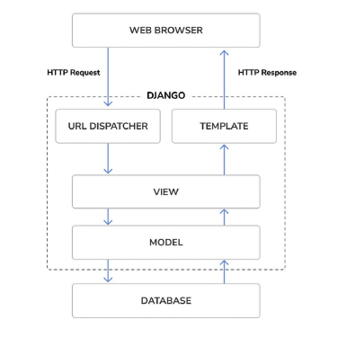

## 1. Understanding `MTV (Model-Template-View) `pattern.

- Django follows the MTV (Model-Template-View) pattern.

The responsibilities in the Django MTV pattern are divided as follows:

• `Model`: This defines the logical data structure and is the data handler between the database
and the view.
• `Template`: This is the presentation layer. Django uses a plain-text template system that keeps
everything that the browser renders.
• `View`: This communicates with the database via the model and transfers the data to the template
for viewing.

When developing any Django project, you will always work with `models`, `views`, `templates`, and `URLs`.

